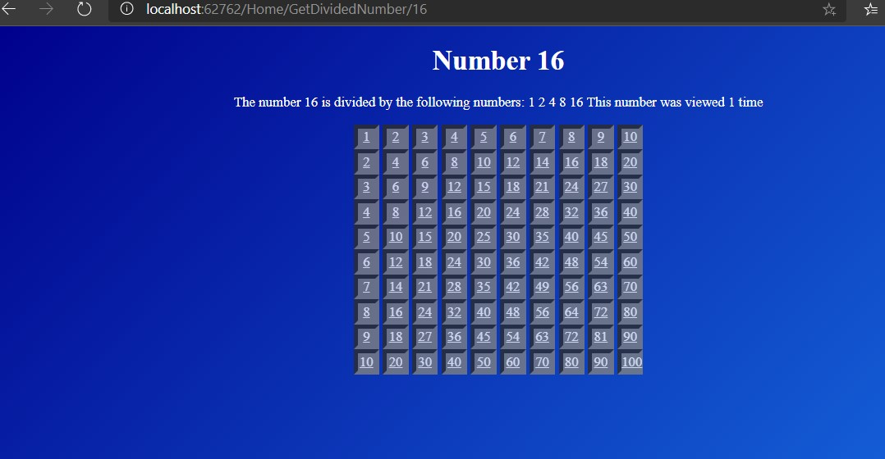
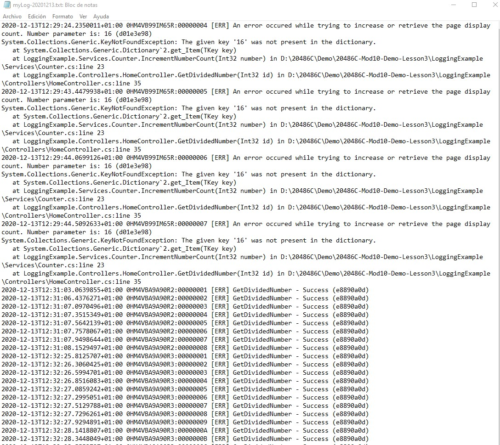

# Tareas del MOC

## Module 10: Testing and Troubleshooting

# Lesson 3: Logging MVC Applications

### Demonstration: How to Log an MVC Application

- EN program.cs configuramos el Logging
- En appsettings colocamos el nivel de trazas en desarrollo y en produccion
- En **HomeController** injectamos el logger

Cambiamos el codigo en la clase **counter** y ejecutamos

podemos comprobaR el log

